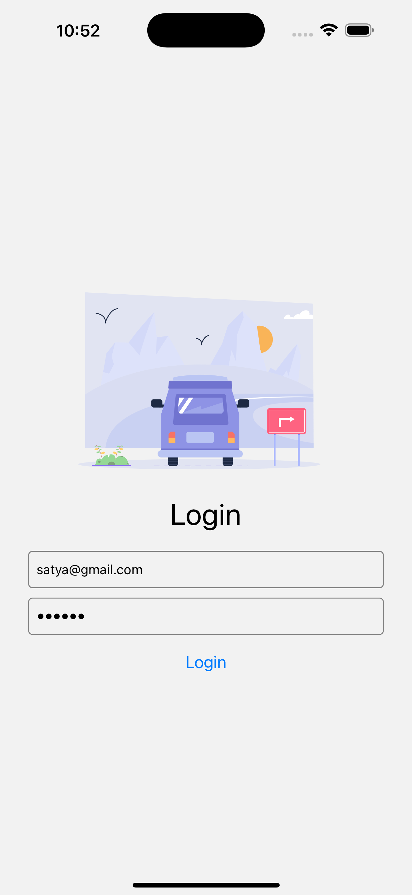
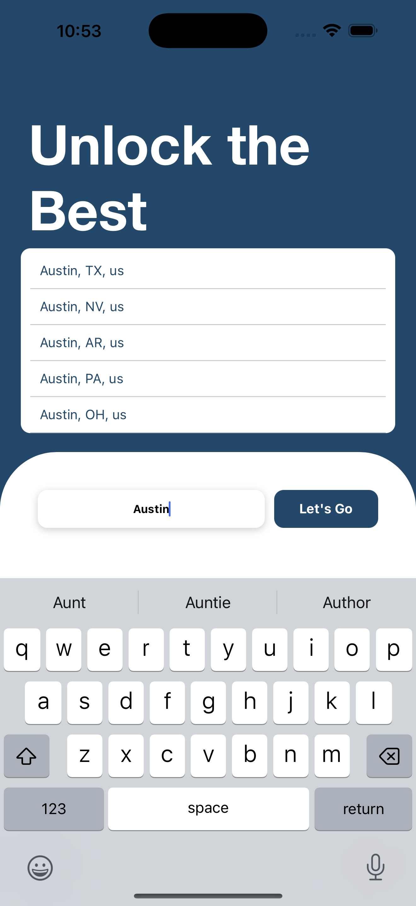

# TravelGuide - Smart Travel Companion

### Problem Statement

Traveling to new destinations can often be overwhelming for tourists due to the lack of accessible and personalized information about local attractions, accommodations, and events. Tourists frequently struggle to find reliable recommendations for entertainment spots, places to stay, and upcoming events, leading to a less enjoyable travel experience. Additionally, local businesses often face challenges in attracting tourists, resulting in missed opportunities for growth.

### Hypothesis

By developing a smart travel app that provides real-time, location-based recommendations and integrates with local businesses, we can simplify travel planning for tourists while boosting visibility and customer engagement for local businesses. This triangular business model will create a win-win situation for both tourists and local enterprises.

---

### Key Features

- **Personalized Recommendations**:

  - Suggestions for entertainment spots, accommodations, tourist attractions, and events based on user preferences and location.

  - Integration with local businesses to provide exclusive access to specific spots

- **Real-Time Location-Based Suggestions**:
  - Dynamic recommendations based on the user's current location and search history.
- **Guide Functionality**:
  - A list of local guides with availability status, allowing users to book guides directly through the app.
- **Social Sharing**:
  - Users can share their travel experiences, photos, and event details with others in a centralized feed.
- **Business Integration**:
  - A dedicated interface for local businesses to manage appointments and monitor customer engagement.

---

### 🛠 Technologies

<table>
  <tr>
    <td><strong>Frontend</strong></td>
    <td></td>
    <td></td>
    <td></td>
    <td></td>
    
  </tr>
  <tr>
    <td><strong>Backend</strong></td>
    <td></td>
    <td></td>
    <td></td>
    <td></td>
  </tr>
  <tr>
    <td><strong>APIs & Services</strong></td>
    <td></td>
    <td></td>
    <td></td>
    <td></td>
  </tr>

  <tr>
  <td><strong>Tools</strong></td>
  <td></td>
  <td></td>
  <td></td>
  <td></td>
  </tr>
</table>

---

### Team and Responsibilities

#### Team Lead

- **Name**: Satya Nandan Thota
  - **Role**: Project management, frontend development, and backend integration.
  - **Responsibilities**:
    - Oversee project progress and delivery.
    - Develop frontend and integrate backend functionality.

#### Team Members

1. **Name**: Vijay Kumar Chelluboyana

   - **Role**: Data processing and backend microservices.
   - **Responsibilities**:
     - Collect and process app data.
     - Develop backend microservices and API integrations.

2. **Name**: Bharath Babu

   - **Role**: Data fetching and microservices support.
   - **Responsibilities**:
     - Assist in data fetching and microservices.
     - Ensure data accuracy and reliability.

3. **Name**: Sri Ramgopal Tandra
   - **Role**: Frontend UI/UX design.
   - **Responsibilities**:
     - Design user-friendly UI/UX.
     - Collaborate on frontend implementation.

---

### Members

<table>
  <tr>
    <td style="text-align: center;">
      
    </td>
    <td style="text-align: center;">
       
    </td>
    <td style="text-align: center;">
      
    </td>
    <td style="text-align: center;">
       
    </td>
  </tr>
  <tr>
    <td style="text-align: center;">
  
<strong>Satya Nandan Thota</strong>

</td>
<td style="text-align: center;">
  
<strong>Sri Ramgopal Tandra</strong>

</td>
<td style="text-align: center;">
  
<strong>Vijay Kumar Chelluboyana</strong>

</td>
<td style="text-align: center;">
  
<strong>Bharath Babu</strong>

</td>
  </tr>
</table>
### Our Work

<table>
  <tr>
    <td style="text-align: center;">
  
<strong>Login Screen</strong>

</td>
<td style="text-align: center;">
  
<strong>Input Section for City</strong>

</td>
<td style="text-align: center;">
  
<strong>Suggestions Screen</strong>

</td>
  </tr>
  <tr>
    <td style="text-align: center;">
      
    </td>
    <td style="text-align: center;">
       
    </td>
    <td style="text-align: center;">
      
    </td>
  </tr>
</table>
